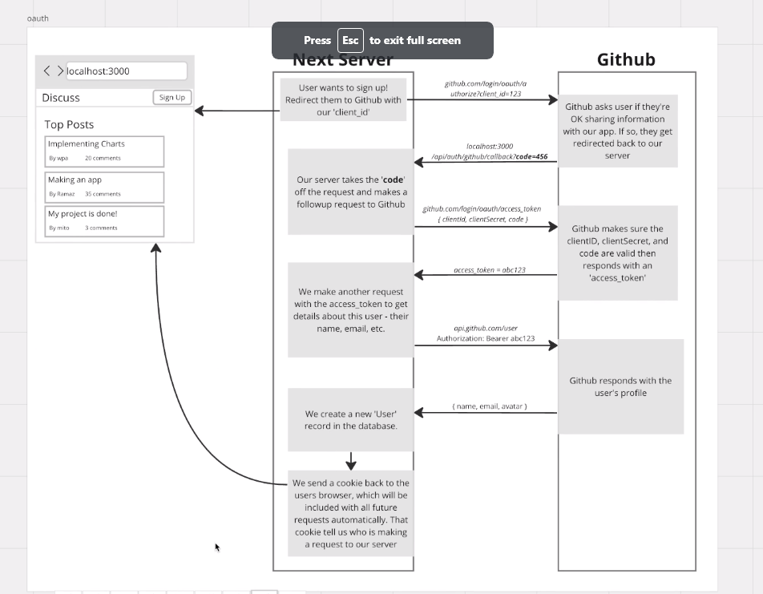

prisma
nextui
next-auth /authjs
github OAuth -> 

/home page -> bunch of posts post belong to some topic

Home |  /   | many posts many posts

Topic Show | /topic/[slug] | A single and many posts

Create a post  | /topics/[slug]/posts/new | A single topic and many posts

Show a post | /topics/[slug]/posts/[postId] | A single post and many comments

## 2. Path helper functions

## Create your routing folder + page.tsx files based on step 

# 4. Identify the places where data changes in your app
# 5. Make empty server actions for each of those
# 6. Add in comments on what paths you'll need to revalidate for each server action

